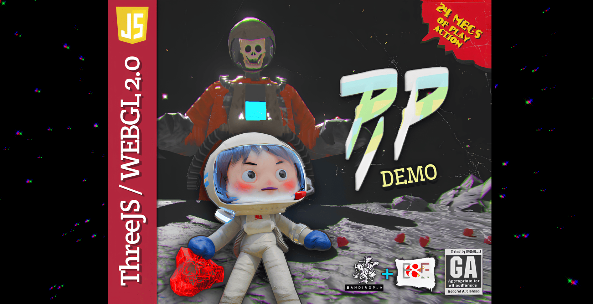
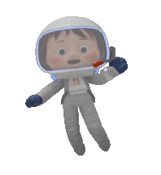

# PIP: Skull demo

## This game demo #2 of `PIP: Planetary Interstellar Pioneer`
Done with [ThreeJs](https://threejs.org/) and using [Blender](https://www.blender.org/) for modeling, animation and texturing.

The first demo was done in [Unity](https://unity.com/) you can [Download the unity demo here](https://bandinopla.itch.io/pionera-interestelar-planetaria) or [see the gameplay here](https://www.youtube.com/watch?v=n74e3-JQP1k). But eventually decided to give threejs a go.

## The concept
You control the main character called "Kukita" that is an astronaut of an experimental space program designed to explore the space and open new frontiers. Due to mismanagement and bureaucracy, she ends up drifting alone in space, relying solely on her wits to find a way to escape.

## The development
The main concept for the character was created by [Bullzara](https://www.youtube.com/@bullzara) and I focused on the story and enemies. Also I did all the models, texturing, animations, coding, etc... all the technical stuff. I did used AI for guidance, special mentions to [Gemini](https://gemini.google.com/) and [Grok](https://x.com/i/grok) that I found particularly helpful, even friendly and nice to interact with. The few images I generated with AI like the skulls & hearts icons were done by [ChatGPT](https://chatgpt.com/) and for the music obviously the one and only [Suno](https://suno.com/)

## Time
This demo took me 2 months to complete due to some unexpected technicall issues regarding optimization (the original version was 70Mb ang got it down to 24Mb) The first MVP had a progress bar, but it was slow and annoying for me... so opted to rewrite the entire assets system and go for a stream on demand type of load, no progress bars... Not to mention, I had to do a retopology of the few models I downloaded from Sketchfab ( a rock model and the power drill ) and reduce the polygon count that was way way too high... also the textures were 4k and the UV was a disaster... sorry to say but it's true.

## Did I played the game and beat it?
Yes. Yes I did, I'm proud to say. It was hard, and felt stressed playing because took me a few runs to got it right, but once I finished it, I felt the rush of victory and knew this was ready for release. Someone will get some fun out of this thing for sure! I did.

# Wanna play?

